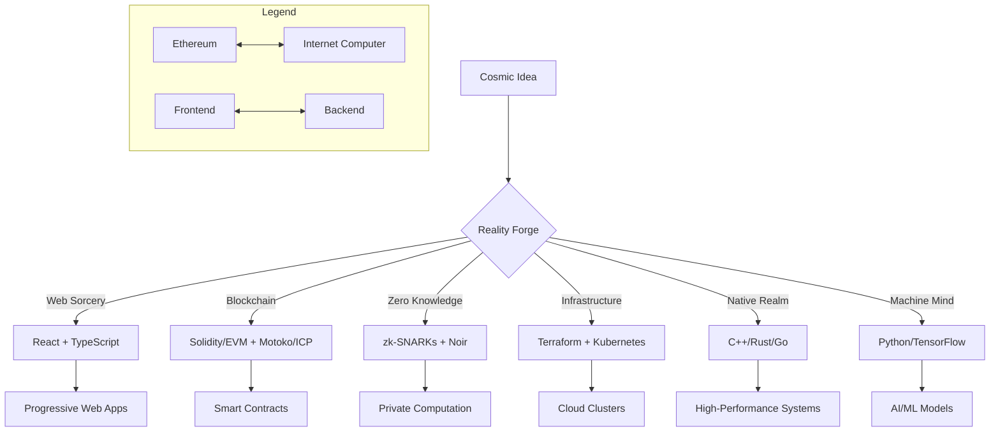

<p align="center">

```diff
+╔═════════════════════════════════════════════════════════════════════╗
+_________   ___ _____________.___  ___________________.___ _______    ║
+\_   ___ \ /   |   \______   \   |/   _____/\______   \   |\      \   ║
+/    \  \//    ~    \       _/   |\_____  \  |     ___/   |/   |   \  ║
+\     \___\    Y    /    |   \   |/        \ |    |   |   /    |    \ ║
+ \______  /\___|_  /|____|_  /___/_______  / |____|   |___\____|__  / ║
+        \/       \/        \/            \/                       \/  ║
+╚═════════════════════════════════════════════════════════════════════╝
+ ████████╗███████╗ ██████╗██╗  ██╗    ██████╗ ██████╗ ██╗███╗   ███╗
+ ╚══██╔══╝██╔════╝██╔════╝██║  ██║   ██╔════╝██╔═══██╗██║████╗ ████║
+    ██║   █████╗  ██║     ███████║   ██║     ██║   ██║██║██╔████╔██║
+    ██║   ██╔══╝  ██║     ██╔══██║   ██║     ██║   ██║██║██║╚██╔╝██║
+    ██║   ███████╗╚██████╗██║  ██║██╗╚██████╗╚██████╔╝██║██║ ╚═╝ ██║
+    ╚═╝   ╚══════╝ ╚═════╝╚═╝  ╚═╝╚═╝ ╚═════╝ ╚═════╝ ╚═╝╚═╝     ╚═╝
```
</p>  
<svg xmlns="http://www.w3.org/2000/svg" width="720" height="160" viewBox="0 0 720 160" role="img" aria-label="Cosmic terminal banner">
  <!-- Terminal header -->
  <text x="32" y="48" font-family="'SF Mono','Fira Code',monospace" 
        font-weight="700" font-size="18" fill="url(#textGrad)">
    ➜ @chrispin-m ~
  </text>
  
  <!-- Pulsing cursor -->
  <rect x="268" y="34" width="8" height="16" rx="2" fill="#7ef9a2"/>
  
  <!-- Tech stack -->
  <text x="32" y="80" font-family="'Fira Code',monospace" font-size="12" fill="#c0d7ff">
    Python · Rust · Motoko · Solidity · TypeScript · React · Vue
  </text>
  <text x="32" y="102" font-family="'Fira Code',monospace" font-size="12" fill="#c0d7ff">
    Web3 · Smart Contracts · CI/CD · Security · AI/ML · Distributed Systems
  </text>
  <text x="32" y="124" font-family="'Fira Code',monospace" font-size="12" fill="#c0d7ff">
    Open-source alchemist 🔮 · Shipping impossible things since 2015
  </text>
  
  <!-- Etherial glow line -->
  <rect width="100%" height="4" fill="url(#textGrad)" opacity="0.1"/>
</svg>

<h1 align="center">🌌 Chrispin Mwangi Wachira</h1>
<h3 align="center">Digital Architect · Code Sorcerer · Reality Bender</h3>

> *"Building impossible systems at the intersection of cryptography and chaos"*

---
## 🧙‍♂️ Tech Grimoire: The Architect's Arsenal


---

## 🗺️ Reality Forging Map



---

## 📊 GitHub Alchemy Circle

<!-- Dynamic stats with interactive elements -->
<div align="center">

[](https://github.com/Chrispin-m)
[](https://github.com/Chrispin-m)

[](https://git.io/streak-stats)
</div>
---

## 🧪 Lab Notes

- 🔭 Crafting **on-chain DNA sequencers** using decentralized oracles
- 🌱 Growing **zk-rollup ecosystems** for private computational markets
- 🧠 Teaching smart contracts to dream using **neural circuit synthesis**
- 🛡️ Building **self-shielding protocols** against quantum decoherence
- ⚗️ Distilling **cryptographic essence** from blockchain entropy fields

---

## 🌀 Just For Fun

<p align="center">

🟣🟢🟦  <strong>Chrispin</strong>  🟦🟢🟣

<pre style="font-family:monospace">
  ➜ @Chrispin-m ~ $ curl https://chrispin.dev | reality-bend --ethereal
      ▸  . . . Downloading quantum state vectors...
      ▸  . . . Compiling reality distortion field...
      ✓  . . . Reality matrix initialized.  Welcome to the ether.
</pre>

</p>
---

## 🌌 Connect With-

[](https://t.me/Cspiny)
[](https://github.com/Chrispin-m)

**Random Stuff:** `[Love Story](https://ichrispindiary.vercel.app/love-life)`

---

## 🧬 Codex Principles

```diff
+ Systems must breathe like living organisms
+ Security through transparency & simplicity
+ Every dependency is a potential reality fracture
+ Documentation as spellcraft ritual
+ Tests as temporal stability anchors
```

---

> *"Give me a star ⭐ - my code runs faster when it feels loved. It’s science. Trust me."*

<p align="center">
  
</p>


