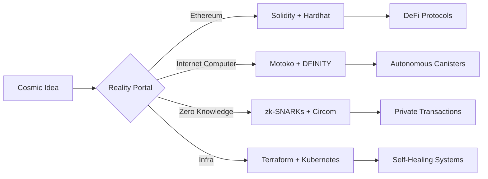

<p align="center">
<svg xmlns="http://www.w3.org/2000/svg" 
     width="720" height="160" viewBox="0 0 720 160" 
     preserveAspectRatio="xMidYMid meet" 
     role="img" aria-label="Chrispin-m — terminal banner">
  <defs>
    <!-- Enhanced background gradient with cosmic shift -->
    <linearGradient id="bgGrad" x1="0%" y1="0%" x2="100%" y2="100%">
      <stop offset="0%" stop-color="#0a1028">
        <animate attributeName="stop-color" dur="12s" values="#0a1028;#0c1a40;#071634;#0a1028" repeatCount="indefinite" />
      </stop>
      <stop offset="100%" stop-color="#071c3a">
        <animate attributeName="stop-color" dur="15s" values="#071c3a;#0a2548;#0d1430;#071c3a" repeatCount="indefinite" />
      </stop>
    </linearGradient>
    
    <!-- Enhanced orb glow with pulse effect -->
    <radialGradient id="orb" cx="50%" cy="50%" r="50%">
      <stop offset="0%" stop-color="#00ffea" stop-opacity="0.9">
        <animate attributeName="stop-opacity" dur="4s" values="0.9;0.7;0.9" repeatCount="indefinite"/>
      </stop>
      <stop offset="70%" stop-color="#0088ff" stop-opacity="0.5"/>
      <stop offset="100%" stop-color="#000720" stop-opacity="0"/>
    </radialGradient>
    
    <!-- Text gradient with subtle shift -->
    <linearGradient id="textGrad" x1="0%" x2="100%">
      <stop offset="0%" stop-color="#7ef9a2">
        <animate attributeName="stop-color" dur="8s" values="#7ef9a2;#a2f9e8;#7ef9a2" repeatCount="indefinite"/>
      </stop>
      <stop offset="100%" stop-color="#7ad8ff">
        <animate attributeName="stop-color" dur="8s" values="#7ad8ff;#d87aff;#7ad8ff" repeatCount="indefinite"/>
      </stop>
    </linearGradient>
    
    <!-- Etherial particle field -->
    <pattern id="particles" width="8" height="8" patternUnits="userSpaceOnUse">
      <circle cx="2" cy="2" r="0.5" fill="#fff" opacity="0.2">
        <animate attributeName="opacity" values="0.1;0.3;0.1" dur="3s" repeatCount="indefinite"/>
      </circle>
      <circle cx="6" cy="6" r="0.7" fill="#aaffff" opacity="0.15">
        <animate attributeName="opacity" values="0.05;0.25;0.05" dur="4s" repeatCount="indefinite"/>
      </circle>
    </pattern>
  </defs>

  <!-- Background with cosmic gradient -->
  <rect width="100%" height="100%" rx="16" fill="url(#bgGrad)"/>
  
  <!-- Particle overlay -->
  <rect width="100%" height="100%" rx="16" fill="url(#particles)" opacity="0.4"/>
  
  <!-- Etherial orbs with floating paths -->
  <g opacity="0.85" filter="url(#glow)">
    <circle cx="120" cy="40" r="36" fill="url(#orb)">
      <animateMotion path="M0,0 C30,-15 10,40 -20,30 0,0" dur="18s" repeatCount="indefinite"/>
      <animate attributeName="r" values="36;40;36" dur="8s" repeatCount="indefinite"/>
    </circle>
    <circle cx="600" cy="100" r="24" fill="url(#orb)">
      <animateMotion path="M0,0 C-25,15 10,-30 5,20 0,0" dur="16s" repeatCount="indefinite"/>
      <animate attributeName="opacity" values="0.7;0.9;0.7" dur="5s" repeatCount="indefinite"/>
    </circle>
    <circle cx="400" cy="120" r="18" fill="url(#orb)">
      <animateMotion path="M0,0 C15,-20 -10,15 0,0" dur="14s" repeatCount="indefinite"/>
      <animate attributeName="r" values="18;22;18" dur="6s" repeatCount="indefinite"/>
    </circle>
  </g>

  <!-- Terminal header with warp effect -->
  <text x="32" y="48" font-family="'SF Mono','Fira Code',monospace" 
        font-weight="700" font-size="18" fill="url(#textGrad)">
    ➜ chrispin@ethereal ~
    <animateTransform attributeName="transform" type="skewX" values="0;-2;0;2;0" dur="15s" repeatCount="indefinite"/>
  </text>

  <!-- Pulsing cursor -->
  <rect x="268" y="34" width="8" height="16" rx="2" fill="#7ef9a2">
    <animate attributeName="opacity" values="1;0.2;1" dur="1.2s" repeatCount="indefinite"/>
    <animate attributeName="width" values="8;12;8" dur="1.5s" repeatCount="indefinite"/>
  </rect>

  <!-- Floating tech lines -->
  <text x="32" y="80" font-family="'Fira Code',monospace" font-size="12" fill="#c0d7ff" opacity="1">
    <tspan>Python · Rust · Motoko · Solidity · TypeScript · React · Vue</tspan>
    <animate attributeName="opacity" values="0.8;1;0.8" dur="6s" repeatCount="indefinite"/>
    <animateTransform attributeName="transform" type="translate" values="0,0;0,-2;0,0" dur="3s" repeatCount="indefinite"/>
  </text>

  <text x="32" y="102" font-family="'Fira Code',monospace" font-size="12" fill="#c0d7ff" opacity="0.9">
    <tspan>Web3 · Smart Contracts · CI/CD · Security · AI/ML · Distributed Systems</tspan>
    <animate attributeName="opacity" values="0.7;0.9;0.7" dur="7s" repeatCount="indefinite"/>
    <animateTransform attributeName="transform" type="translate" values="0,0;0,2;0,0" dur="4s" repeatCount="indefinite"/>
  </text>

  <text x="32" y="124" font-family="'Fira Code',monospace" font-size="12" fill="#c0d7ff" opacity="0.85">
    <tspan>Open-source alchemist 🔮 · Shipping impossible things since 2015</tspan>
    <animate attributeName="opacity" values="0.6;0.85;0.6" dur="5s" repeatCount="indefinite"/>
    <animateTransform attributeName="transform" type="translate" values="0,0;0,-1;0,0" dur="2s" repeatCount="indefinite"/>
  </text>

  <!-- Etherial top glow -->
  <rect width="100%" height="4" fill="url(#textGrad)" opacity="0.1">
    <animate attributeName="opacity" values="0.05;0.15;0.05" dur="6s" repeatCount="indefinite"/>
  </rect>
  
  <!-- Glow filter for orbs -->
  <filter id="glow" x="-50%" y="-50%" width="200%" height="200%">
    <feGaussianBlur stdDeviation="4" result="coloredBlur"/>
    <feMerge>
      <feMergeNode in="coloredBlur"/>
      <feMergeNode in="SourceGraphic"/>
    </feMerge>
  </filter>
</svg>
</p>

<h1 align="center">🌌 Chrispin Mwangi Wachira</h1>
<h3 align="center">Digital Architect · Code Sorcerer · Reality Bender</h3>

> *"Building impossible systems at the intersection of cryptography and chaos"*

---

## 🔮 Tech Grimoire


---

## A Map Maybe?



---

## 🧪 Lab Notes

- 🔭 Crafting **on-chain DNA sequencers** using decentralized oracles
- 🌱 Growing **zk-rollup ecosystems** for private computational markets
- 🧠 Teaching smart contracts to dream using **neural circuit synthesis**
- 🛡️ Building **self-shielding protocols** against quantum decoherence
- ⚗️ Distilling **cryptographic essence** from blockchain entropy fields

---

## 📜 GitHub Chronicles

<!-- GitHub stats with ethereal theme -->
<p align="center">
  <a href="https://github.com/Chrispin-m">
    
    
  </a>
</p>

---

## 🌀 Terminal Portal for fun

<p align="center">
<svg xmlns="http://www.w3.org/2000/svg" width="720" height="180" viewBox="0 0 720 180" preserveAspectRatio="xMidYMid meet">
  <defs>
    <!-- Terminal glow gradient -->
    <linearGradient id="terminalGrad" x1="0%" y1="0%" x2="0%" y2="100%">
      <stop offset="0%" stop-color="#0a1a2a" stop-opacity="0.9"/>
      <stop offset="100%" stop-color="#07162a" stop-opacity="0.95"/>
    </linearGradient>
    
    <!-- Neon text gradient -->
    <linearGradient id="neon" x1="0%" x2="100%">
      <stop offset="0%" stop-color="#7ef9a2"/>
      <stop offset="100%" stop-color="#7ad8ff"/>
    </linearGradient>
    
    <!-- Animated command reveal -->
    <clipPath id="typeReveal">
      <rect id="revealer" width="0" height="30"/>
    </clipPath>
  </defs>
  
  <!-- Terminal body -->
  <rect x="20" y="20" width="680" height="140" rx="10" fill="url(#terminalGrad)" stroke="#2a3f5f" stroke-width="1"/>
  
  <!-- Header -->
  <text x="40" y="50" font-family="'Fira Code',monospace" font-size="16" fill="url(#neon)">
    ➜ chrispin@portal ~
  </text>
  
  <!-- Command line with typing effect -->
  <g transform="translate(40, 90)">
    <g clip-path="url(#typeReveal)">
      <text font-family="'Fira Code',monospace" font-size="14" fill="#c0d7ff">
        > curl https://cosmos.chrispin.dev | reality-bend --ethereal
      </text>
    </g>
    <rect x="0" y="-10" width="2" height="20" fill="url(#neon)">
      <animate attributeName="opacity" values="1;0" dur="0.7s" repeatCount="indefinite"/>
      <animate attributeName="x" from="0" to="440" begin="3s" dur="0.1s" fill="freeze"/>
    </rect>
  </g>
  
  <!-- Output lines -->
  <text x="40" y="120" font-family="'Fira Code',monospace" font-size="12" fill="#a0b0ff" opacity="0">
    ▸ Downloading quantum state vectors...
    <animate attributeName="opacity" begin="3.5s" values="0;1" dur="0.3s" fill="freeze"/>
  </text>
  
  <text x="40" y="140" font-family="'Fira Code',monospace" font-size="12" fill="#a0b0ff" opacity="0">
    ▸ Compiling reality distortion field... 
    <animate attributeName="opacity" begin="4s" values="0;1" dur="0.3s" fill="freeze"/>
    <animate attributeName="fill" values="#a0b0ff;#7ef9a2" begin="5s" dur="1s" fill="freeze"/>
  </text>
  
  <text x="40" y="160" font-family="'Fira Code',monospace" font-size="12" fill="#7ef9a2" opacity="0">
    ✓ Reality matrix initialized. Welcome to the ether.
    <animate attributeName="opacity" begin="5.5s" values="0;1" dur="0.5s" fill="freeze"/>
  </text>
  
  <!-- Animate the revealer -->
  <animate href="#revealer" 
           attributeName="width" 
           from="0" 
           to="440" 
           dur="3s" 
           begin="0.5s" 
           fill="freeze"/>
  
  <!-- Floating particles -->
  <circle cx="100" cy="70" r="1.5" fill="#7ad8ff" opacity="0.7">
    <animateMotion path="M0,0 C20,15 -10,20 0,0" dur="9s" repeatCount="indefinite"/>
  </circle>
  
  <!-- Terminal glow effect -->
  <rect x="20" y="20" width="680" height="140" rx="10" fill="none" stroke="url(#neon)" stroke-width="0.5" opacity="0.15">
    <animate attributeName="opacity" values="0.1;0.2;0.1" dur="4s" repeatCount="indefinite"/>
  </rect>
</svg>
</p>

---

## 🌌 Connect With-

[](https://t.me/Cspiny)
[](https://github.com/Chrispin-m)

**Random Stuff:** `chrispin@reality-bender.sig`

---

## 🧬 Codex Principles

```diff
+ Systems must breathe like living organisms
+ Security through transparency & simplicity
+ Every dependency is a potential reality fracture
+ Documentation as spellcraft ritual
+ Tests as temporal stability anchors
```

---

> *"Give me a star ⭐ - my code runs faster when it feels loved. It’s science. Trust me."*
```
